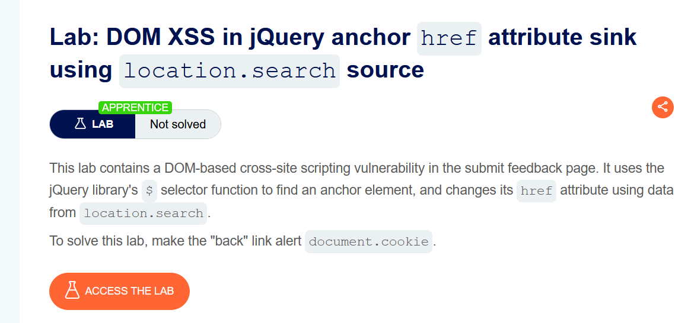
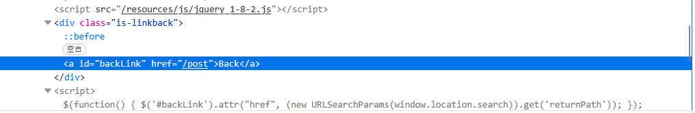
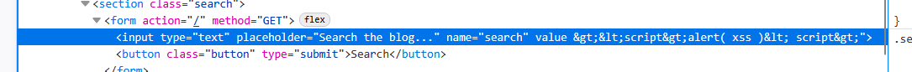
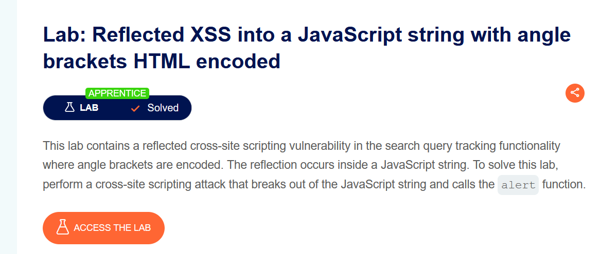
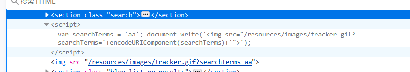

# apprentice
## 1. DOM XSS in document.write sink using source location.search
document.write向html写内容。search属性是一个可读可写的字符串，可设置或返回当前URL的查询部分，即问号?之后的部分。

输入框的内容会放入img标签中

将img标签闭合,输入"><script>alert(1)</script>，XSS触发。
## 2.DOM XSS in innerHTML sink using source location.search
不执行插入的<script>标签。故输入其他标签触发js代码
``````
img标签当资源加载失败或无法使用时，触发onerror。
## 3.DOM XSS in jQuery anchor href attribute sink using location.search source
herf可以链接到URL，也可以加载脚本（比如 href="javascript:alert('1');"）

提示点击back回到上一页

back按钮的herf会获取renturnpath中的值。如果将returnpath该改成我们要执行获取cookie的js代码```javascript:alert(doucment.cookie)```，则也会被传进herf属性，又由于href属性是可以加载脚本的，所以会执行这个js代码。从而达到获取cookie的效果。
## 4.Reflected XSS into attribute with angle brackets HTML-encoded

可以看到value中<、/这些都被编码
输入代码创建鼠标移动事件，注意把前后的双引号闭合 ```"onmouseover="alert(/xss/)```

## 5.Reflected XSS into a JavaScript string with angle brackets HTML encoded

在搜索栏中搜索，注意以下script代码

闭合前后的单引号，并且构造成一个完整js语句';alert(1);'，触发XSS弹窗。

# Practitioner
