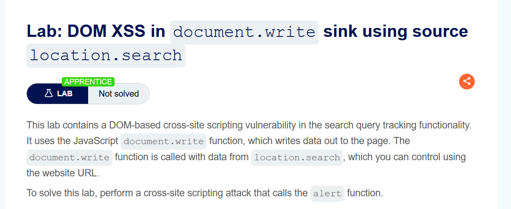
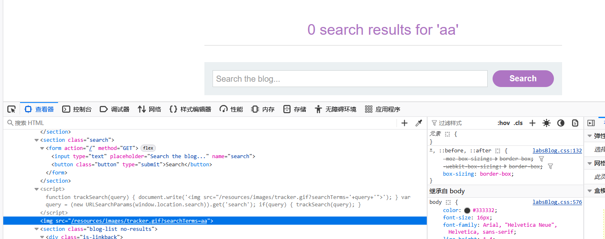

# apprentice
## 1. DOM XSS in document.write sink using source location.search
document.write向html写内容。search属性是一个可读可写的字符串，可设置或返回当前URL的查询部分，即问号?之后的部分。

输入框的内容会放入img标签中

将img标签闭合,输入">，XSS触发。
## 2.DOM XSS in innerHTML sink using source location.search
不执行插入的<script>标签。故输入其他标签触发js代码，，img标签当资源加载失败或无法使用时，触发onerror。
